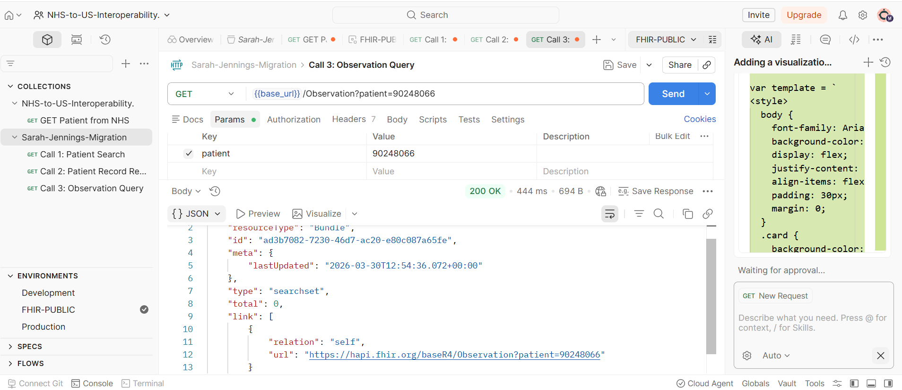
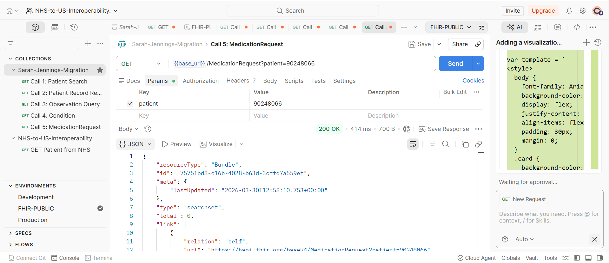

# API Testing & Interaction Log
## NHS-to-US Interoperability Project- Sarah Jennings Migration

This document provides technical evidence of FHIR API discovery,
connectivity testing, and data structure analysis conducted as part
of the Sarah Jennings cross-border migration project.

Two FHIR environments were tested:
- **NHS Digital Sandbox** -> UK Personal Demographics Service (PDS)
- **HAPI FHIR R4 Public Server** -> Open test server for FHIR R4 analysis

---

## Test Case 01: NHS API Validation & Error Handling
**Collection:** NHS-to-US-Interoperability
**Endpoint:** `GET https://sandbox.api.service.nhs.uk/
             personal-demographics/FHIR/R4/Patient/9000000033`
**Headers:** `Accept: application/fhir+json`
             `X-Request-ID: Sarah-Project-Test`
**Status Returned:** `400 Bad Request`
**Response Time:** 867ms | **Size:** 598B

### BA Analysis
The 400 response confirms the NHS API Gateway is active and 
responding in FHIR format- the `OperationOutcome` resource 
in the response body proves the server is FHIR R4 compliant.

The specific error code `INVALID_VALUE` with system 
`https://fhir.nhs.uk/R4/CodeSystem/Spine-ErrorOrWarningCode`
reveals something technically significant:

The NHS Number `9000000033` fails the **Modulus 11 checksum**- 
a mathematical validation algorithm built into the NHS Number 
standard itself. The API Gateway validates the identifier format 
BEFORE checking authentication credentials.

**Interoperability Implication:**
Any transformation middleware sending NHS data to this API must
validate NHS Number checksums programmatically before making API calls.
A system that sends a malformed NHS Number will receive a 400,
which could be misdiagnosed as an authentication failure
without understanding this validation layer.

---

## Test Case 02: Patient Search & Bundle Structure Analysis
**Collection:** Sarah-Jennings-Migration- Call 1
**Endpoint:** `GET https://hapi.fhir.org/baseR4/Patient?_count=5`
**Status Returned:** `200 OK`
**Response Time:** 25.25s | **Size:** 4.73KB

### BA Analysis
The response is a FHIR `Bundle` of type `searchset`- a container that packages multiple Patient resources together.

**What I was looking for in the identifier array:**
Each patient record contains an `identifier` element with two fields:
- `system`- the organisation or standard that issued the ID
  (e.g. `https://fhir.nhs.uk/Id/nhs-number` for NHS,
  or a hospital-specific URL for MRNs)
- `value`- the actual ID number

This system/value pair structure is the FHIR mechanism for
distinguishing between an NHS Number, an MRN, and an 
insurance member ID- they all live in the same field
but are differentiated by their system URL.

**Key Finding:**
In a cross-border migration, the receiving US system must
read the `system` field to understand what type of identifier
it is receiving- it cannot assume every identifier is an MRN.

---

## Test Case 03: Individual Patient Record Retrieval
**Collection:** Sarah-Jennings-Migration- Call 2
**Endpoint:** `GET {{base_url}}/Patient/90248066`
**Status Returned:** `200 OK`
**Response Time:** 369ms | **Size:** 1.05KB

### BA Analysis
A complete Patient resource was returned for ID 90248066.

**US Core Compliance Check:**
Reviewing this record against the US Core profile requirements,
I identified the following gap:

| Required Field (US Core) | Present in Record | Action Required |
|---|---|---|
| OMB Race Extension |  Missing | Flag as Must-Intervene |
| OMB Ethnicity Extension |  Missing | Flag as Must-Intervene |
| Birth Sex Extension |  Missing | Collect at registration |
| Patient Name |  Present | No action |
| Birth Date |  Present | No action |
| Gender |  Present | No action |

**Migration Decision:**
This record cannot be directly imported into a US Core-compliant
EHR without transformation. The missing mandatory extensions
must be either defaulted to "Unknown" or collected manually
at the US patient registration before the first clinical encounter.

---

## Test Case 04: Observation Query- Clinical Data Discovery
**Collection:** Sarah-Jennings-Migration - Call 3
**Endpoint:** `GET {{base_url}}/Observation?patient=90248066`
**Status Returned:** `200 OK`- Empty Bundle (`total: 0`)
**Response Time:** 444ms | **Size:** 694B

### BA Analysis
The API call succeeded but returned zero Observation resources.

**This is a meaningful finding, not just a test limitation.**

In a real-world migration scenario, this pattern-
a patient record exists but has no associated clinical data-
represents one of the most dangerous interoperability failures:

A US clinician opening this patient's record would see
demographic information, but no clinical history.
No HbA1c results. No blood pressure readings. No crisis notes.
They would not know whether the data had never been collected
or simply never transferred.

**What this demonstrates technically:**
Observations in FHIR are linked to patients via the 
`subject.reference` field. If the patient ID used in the
source system differs from the ID used in the receiving system
(which happens in cross-border migrations without a shared
identifier), ALL clinical observations become orphaned-
they exist in the database but cannot be retrieved
because the patient reference no longer matches.

This is the patient safety risk at the heart of this project.

---

## Test Case 05: Condition Query- Diagnosis Data Discovery
**Collection:** Sarah-Jennings-Migration- Call 4
**Endpoint:** `GET {{base_url}}/Condition?patient=90248066`
**Status Returned:** `200 OK`- Empty Bundle (`total: 0`)
**Response Time:** 459ms | **Size:** 692B

### BA Analysis
No Condition resources returned for this patient.

**The Coding System Gap:**
Even if Sarah's bipolar disorder diagnosis had been present,
it would be stored using **SNOMED CT** codes in an NHS system.
A US EHR billing module expects **ICD-10-CM** codes for
insurance claim submission.

SNOMED concept `13746004` (Bipolar disorder) does not
automatically translate to ICD-10-CM `F31.9` (Bipolar disorder,
unspecified) — a terminology translation service or
manual mapping is required.

Without this translation:
- The US provider cannot submit a billable claim
- Prior authorisation requests will be rejected
- The patient's insurance will not cover treatment

This is where the clinical data problem becomes a
**Revenue Cycle Management problem**.

---

## Test Case 06: MedicationRequest Query- Medication Data Discovery
**Collection:** Sarah-Jennings-Migration - Call 5
**Endpoint:** `GET {{base_url}}/MedicationRequest?patient=90248066`
**Status Returned:** `200 OK`- Empty Bundle (`total: 0`)
**Response Time:** 414ms | **Size:** 700B

### BA Analysis
No MedicationRequest resources returned for this patient.

**The Medication Coding Gap:**
NHS systems code medications using **dm+d** 
(Dictionary of Medicines and Devices).
US systems use **RxNorm** codes.

For Sarah's insulin and mood stabilisers:
- dm+d code `317249006` (Insulin glargine) 
  must map to RxNorm `274783` before a US pharmacy
  can process or a US payer can adjudicate the claim
- Without this mapping, medication reconciliation 
  at the US provider must be done manually —
  a patient safety risk if Sarah presents in crisis

**The Strategic Implication:**
All three empty bundle results (Observations, Conditions,
MedicationRequests) together demonstrate that demographic
data transfer alone is not sufficient for safe clinical care.
A complete migration requires clinical data,
and clinical data requires terminology translation.
This is the core problem FHIR R4 interoperability solves.

---

## Summary of Technical Skills Demonstrated

| Skill | Evidence |
|---|---|
| RESTful API testing | GET requests with query parameters and custom headers |
| FHIR resource literacy | Bundle, Patient, Observation, Condition, MedicationRequest |
| Error analysis | Modulus 11 validation, OperationOutcome interpretation |
| Environment management | `{{base_url}}` variable across all calls |
| US Core compliance checking | Identified missing mandatory extensions in live response |
| Clinical data governance | Connected empty results to real patient safety risks |
| RCM awareness | Linked coding gaps to claim denial and billing failure |
| Cross-border regulatory knowledge | GDPR/HIPAA, SNOMED/ICD-10, dm+d/RxNorm |

