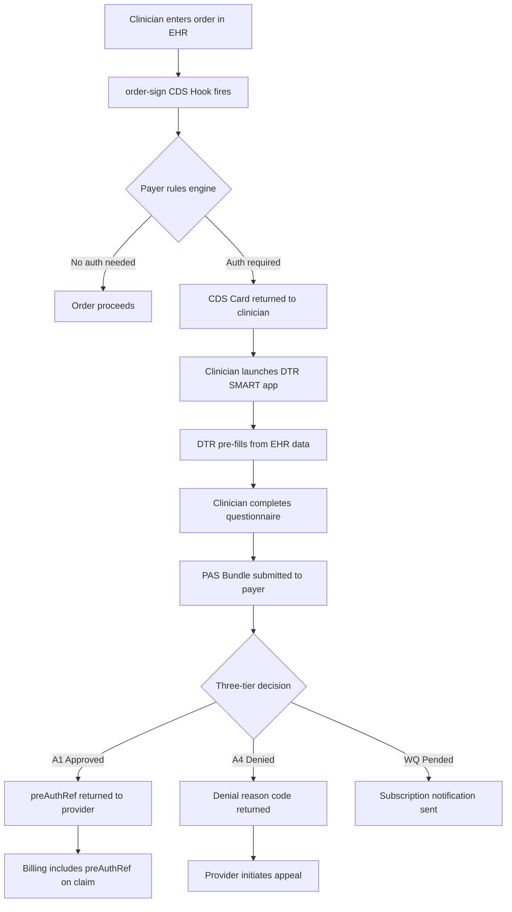

# Da Vinci Prior Authorization Workflow - CRD, DTR, PAS

## Overview

The Da Vinci Project is an HL7 initiative delivering FHIR R4 implementation guides that operationalise CMS-0057-F. Three specifications work in sequence to replace legacy prior authorization workflows:

| Specification | Full Name | Function |
|---|---|---|
| CRD | Coverage Requirements Discovery | Determines at point of care whether prior auth is needed |
| DTR | Documentation Templates and Rules | Collects clinical documentation required for the request |
| PAS | Prior Authorization Support | Submits the prior auth request and returns the decision |

This document specifies the complete workflow from order entry to authorization decision. It is written as a BA specification - not a tutorial - with defined inputs, outputs, and decision points at each stage.

---

## API Evidence

All ClaimResponse resources in this section were validated against the HAPI FHIR R4 public server via Postman. Screenshots are in the screenshots/ folder.

| Call | Method | Result | What it proves |
|---|---|---|---|
| Call 6 | POST | 201 Created | Valid approved ClaimResponse accepted by FHIR server |
| Call 7 | POST | 201 Created | Denied ClaimResponse with mandatory CARC 11 reason code |
| Call 8 | POST | 201 Created | Pended ClaimResponse - WQ outcome for manual review |
| Call 9 | GET | 200 OK | ClaimResponse query returns bundle of results |
| Call 10 | POST | 201 Created | **Key finding** - HAPI accepted ClaimResponse without `use` field |

### Key Finding - Call 10
HAPI FHIR server accepted a ClaimResponse with 201 even when the `use: preauthorization` field was absent. This proves that FHIR server-level validation does not enforce CMS-0057-F business rules.
A ClaimResponse without this field cannot be distinguished from a billing claim by receiving systems. Application-layer compliance checking is required, which is what the compliance-validator.py script addresses.

### Technical Finding - Reference Validation
During testing, HAPI rejected ClaimResponse resources that contained references to Patient and Claim resources that did not exist on the server (HAPI-1094 error). This demonstrates that FHIR reference integrity is enforced at submission time. In production, the Patient resource must be created before the ClaimResponse can reference it.

---

## Stage 1 - CRD: Coverage Requirements Discovery

### Trigger
The CDS Hook fires at the `order-sign` event. This occurs when a clinician finalises an order - medication, procedure, referral - before it is committed to the EHR.

### CDS Hook Request
The EHR sends a hook request to the payer's CDS service containing:

```json
{
  "hookInstance": "a6b2e3c4-d5f6-7890-abcd-ef1234567890",
  "hook": "order-sign",
  "context": {
    "userId": "Practitioner/dr-sarah-chen",
    "patientId": "Patient/sarah-jennings-us",
    "draftOrders": {
      "resourceType": "Bundle",
      "entry": [
        {
          "resource": {
            "resourceType": "MedicationRequest",
            "status": "draft",
            "medicationCodeableConcept": {
              "coding": [
                {
                  "system": "http://www.nlm.nih.gov/research/umls/rxnorm",
                  "code": "41493",
                  "display": "lithium carbonate 300mg"
                }
              ]
            }
          }
        }
      ]
    }
  },
  "prefetch": {
    "patient": "Patient/sarah-jennings-us",
    "coverage": "Coverage/aetna-member-789"
  }
}
```

### CDS Hook Response - Card
The payer's rules engine returns a Card indicating coverage status:

```json
{
  "cards": [
    {
      "summary": "Prior authorization required for lithium carbonate",
      "indicator": "warning",
      "detail": "Lithium carbonate 300mg requires prior authorization under this patient's plan. Launch DTR to complete documentation.",
      "source": {
        "label": "Aetna Coverage Rules Engine",
        "url": "https://aetna.com/coverage-rules"
      },
      "suggestions": [
        {
          "label": "Launch DTR",
          "actions": [
            {
              "type": "create",
              "description": "Open DTR SMART app to collect required documentation"
            }
          ]
        }
      ]
    }
  ]
}
```

### Decision Point
| Card Indicator | Meaning | Next Step |
|---|---|---|
| `info` | No prior auth required | Order proceeds |
| `warning` | Prior auth required | Launch DTR |
| `critical` | Service not covered | Discuss alternative with patient |

---

## Stage 2 - DTR: Documentation Templates and Rules

### Trigger
Clinician selects Launch DTR from the CDS Card. The SMART on FHIR application launches within the EHR context.

### Pre-Fill Mechanism
DTR queries the EHR for existing clinical data using CQL (Clinical Quality Language) logic. For the bipolar disorder prior auth scenario:

| Data Element | FHIR Resource | Pre-filled from |
|---|---|---|
| Diagnosis | Condition | Transformed NHS SNOMED CT -> ICD-10-CM |
| Prior medication history | MedicationRequest | Transformed dm+d -> RxNorm |
| Recent lab results | Observation | LOINC coded observations |
| Treating clinician | Practitioner | EHR directory |

### QuestionnaireResponse Output
DTR produces a completed FHIR QuestionnaireResponse containing all
required clinical documentation:

```json
{
  "resourceType": "QuestionnaireResponse",
  "status": "completed",
  "subject": {
    "reference": "Patient/sarah-jennings-us"
  },
  "item": [
    {
      "linkId": "1",
      "text": "Primary diagnosis requiring treatment",
      "answer": [
        {
          "valueCoding": {
            "system": "http://hl7.org/fhir/sid/icd-10-cm",
            "code": "F31.9",
            "display": "Bipolar disorder, unspecified"
          }
        }
      ]
    },
    {
      "linkId": "2",
      "text": "Previous mood stabiliser trials",
      "answer": [
        {
          "valueString": "Valproate 500mg - discontinued due to side effects. Documented in NHS records, transformed from dm+d to RxNorm on intake."
        }
      ]
    },
    {
      "linkId": "3",
      "text": "Estimated treatment duration",
      "answer": [
        {
          "valueString": "12 months - ongoing maintenance therapy"
        }
      ]
    }
  ]
}
```

### NHS Interoperability Risk at This Stage
If NHS records were not transformed correctly before intake:
- Diagnosis field may contain SNOMED CT code not recognised by DTR CQL logic
- Medication history may be incomplete if dm+d codes were not mapped
- DTR questionnaire will not pre-fill — clinician must enter data manually
- Manual entry increases documentation error risk and submission time
- Incomplete submission is the leading cause of clinical prior auth denials

---

## Stage 3 - PAS: Prior Authorization Support

### PAS Bundle Contents
The completed PAS request is a FHIR Bundle containing eight resources:

| Resource | Clinical Purpose |
|---|---|
| `Claim` (use: preauthorization) | The prior auth request itself - treatment, codes, provider |
| `Patient` | US Core compliant demographics - required for member matching |
| `Coverage` | Insurance membership details - plan, group, member ID |
| `Practitioner` | Requesting clinician - NPI number mandatory |
| `Organization` | Billing provider - Tax ID and NPI |
| `MedicationRequest` | The specific medication requiring authorization |
| `Condition` | ICD-10-CM diagnosis supporting medical necessity |
| `QuestionnaireResponse` | Completed DTR documentation from Stage 2 |

### ClaimResponse Outcomes

The payer returns a ClaimResponse with one of three review action codes.
Full JSON examples are in sample-bundles/ - these were validated against the HAPI FHIR R4 server. See screenshots/ for server responses.

| Code | Meaning | Key Field |
|---|---|---|
| A1 | Approved | `extension.valueString` contains preAuthRef number |
| A4 | Denied | `adjudication.reason` contains mandatory CARC code |
| WQ | Pended | Subscription notification sent when resolved |

### Three-Tier Decision Making

| Tier | Decision Maker | Trigger | Typical Timeframe |
|---|---|---|---|
| 1 | Rules engine (automated) | All requests - auto-approved if criteria met | Seconds |
| 2 | UM nurse review | Rules engine cannot auto-adjudicate - WQ returned | 24-48 hours |
| 3 | Medical director review | Nurse escalates clinically complex or high-cost cases | 48-72 hours |

### Subscription Mechanism for Pended Responses
When WQ is returned, the provider system subscribes to updates using the FHIR Subscription resource. When the payer updates the ClaimResponse, a notification is pushed to the provider without requiring polling.

---

## End-to-End Flow



---

## References

- [Da Vinci CRD Implementation Guide](https://hl7.org/fhir/us/davinci-crd/)
- [Da Vinci DTR Implementation Guide](https://hl7.org/fhir/us/davinci-dtr/en/)
- [Da Vinci PAS Implementation Guide](https://hl7.org/fhir/us/davinci-pas/)
- [CDS Hooks Specification](https://cds-hooks.hl7.org/)
