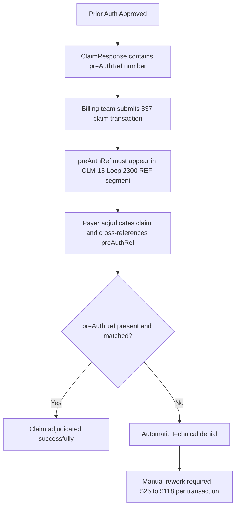

# Denial Management - Prior Authorization and RCM Connection

## Why Denials Happen

Healthcare claim denials fall into three categories:

**Administrative denials** - Caused by data quality failures at registration.
Wrong member ID, inactive coverage at date of service, out-of-network provider not flagged before appointment. For NHS patients transitioning to US healthcare, these are the most common denial types because their records arrive without US-compatible identifiers or insurance history.

**Clinical denials** - Caused by insufficient documentation to meet medical necessity criteria. 
The payer's rules engine cannot confirm that the treatment was appropriate for the diagnosis. When NHS SNOMED CT codes are not translated to ICD-10-CM, the payer system cannot evaluate criteria at all - the claim is rejected before clinical review even begins.

**Technical denials** - Caused by formatting errors, missing required fields, or incorrect transaction codes. 
A claim submitted without a prior authorisation reference number (preAuthRef) when one was required is a technical denial - the clinical documentation may be perfect, but the claim still fails.

---

## The Prior Authorization to Billing Revenue Chain

This is the critical RCM connection that a BA working on interoperability projects must understand:

**The NHS interoperability link:**
If a UK patient's dm+d medication codes were not correctly translated to RxNorm during FHIR transformation, the prior auth request may have been submitted with incorrect drug identifiers. Even if approved, the preAuthRef generated relates to the wrong medication code. When the pharmacy claim is submitted with the correct RxNorm code, the preAuthRef does not match - 
automatic denial. This is a direct revenue consequence of Gap 2 identified in the FHIR analysis section.

---

## CARC Denial Reason Codes Relevant to Interoperability Failures

CARC — Claim Adjustment Reason Codes - are the structured codes payers use to explain why a claim was adjusted or denied. CMS-0057-F mandates these codes must appear in prior auth denials from January 2026.

| CARC Code | Reason | Interoperability Root Cause |
|---|---|---|
| 4 | Service requires prior authorisation | Prior auth not obtained - payer rules engine failed due to missing RxNorm/ICD-10-CM codes |
| 11 | Diagnosis inconsistent with procedure | SNOMED CT not translated to ICD-10-CM |
| 15 | Prior authorisation number invalid | preAuthRef mismatch due to terminology translation error |
| 27 | Expenses incurred after coverage terminated | Patient matching failure - wrong member record retrieved |
| 96 | Non-covered charge | Drug not on formulary - dm+d code not mapped to RxNorm |
| 197 | Precertification absent | Prior auth reference number missing from claim |

---

## How CMS-0057-F Reduces Denials

The CMS-0057-F Prior Authorization final rule, effective January 2026, introduces four changes directly relevant to denial management:

**1. Structured denial reason codes mandatory**
Payers must return a specific reason code for every prior auth denial. Free text alone is insufficient. This enables providers to categorise denials systematically - feeding directly into the SQL analytics in ar-analytics.sql.

**2. Faster turnaround reduces pended claim volume**
72-hour urgent / 7-day standard timelines mean fewer claims sit in accounts receivable waiting for auth decisions. AR aging improves.

**3. Provider Access API gives visibility before submission**
Providers can query what clinical information the payer already holds via the Provider Access API. This reduces documentation gaps that cause clinical denials.

**4. DTR ensures complete documentation at submission**
The Da Vinci Documentation Templates and Rules workflow pre-fills QuestionnaireResponse resources with existing clinical data. Incomplete submissions - the leading cause of clinical denials - are caught before the request leaves the provider system.

---

## References

- [CMS-0057-F Prior Authorization Final Rule - Federal Register](https://www.federalregister.gov/documents/2024/02/08/2024-00895/medicare-and-medicaid-programs-patient-protection-and-affordable-care-act-interoperability-and-prior)
- [CARC Codes - X12 Official Code List](https://x12.org/codes/claim-adjustment-reason-codes)
- [Tackling Rising Denial Rates - Vyne Medical](https://vynemedical.com/blog/tackling-rising-denial-rates-in-2023/)
- [Da Vinci DTR Implementation Guide](https://hl7.org/fhir/us/davinci-dtr/en/)
