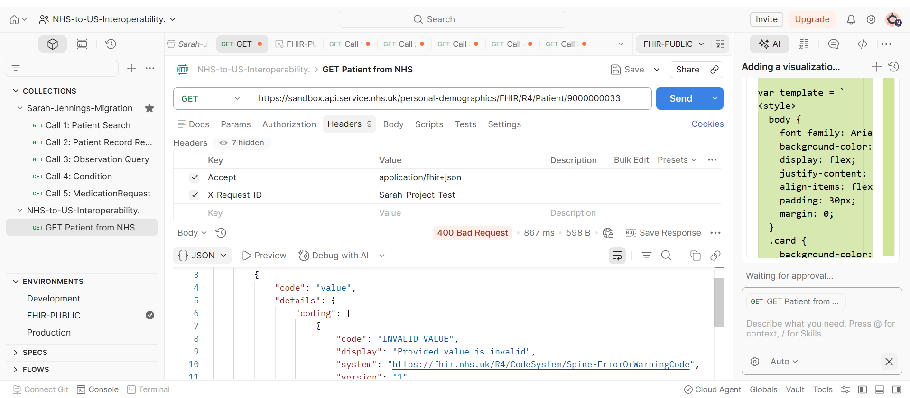
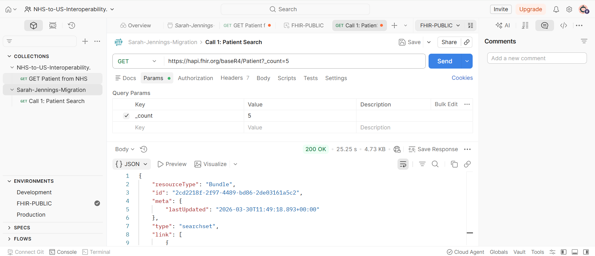
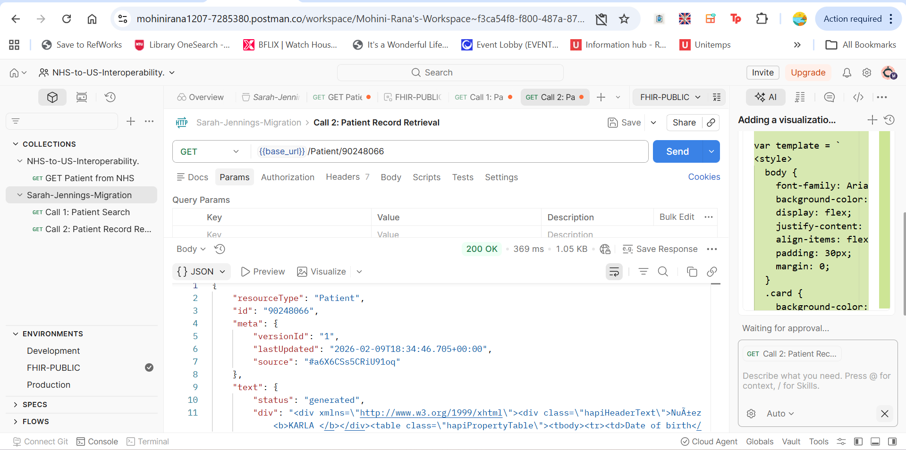
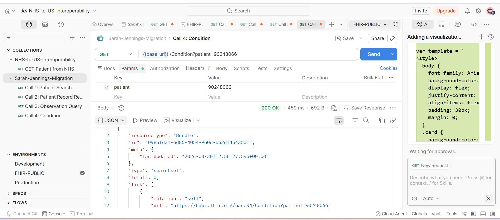

# API Testing & Interaction Results

This document serves as technical evidence of the FHIR API discovery process for the Sarah Jennings migration. It includes connectivity tests with the NHS Digital Sandbox and data structure analysis using the HAPI FHIR R4 server.

---

## 1. Initial Connectivity & Security Test (NHS Sandbox)
**Scenario:** Attempting to reach the UK NHS Personal Demographics Service (PDS).

 

* **Endpoint:** `https://sandbox.api.service.nhs.uk/personal-demographics/FHIR/R4/Patient/9000000033`
* **Status:** `400 Bad Request`
* **BA Analysis:** This response confirms a successful "handshake" with the NHS API Gateway. The `400` status is returned because the Sandbox requires specific `apikey` credentials. Crucially, the response is a valid **FHIR OperationOutcome**, proving the server is ready to communicate in the correct healthcare standard.

---

## 2. Patient Search & Bundle Analysis
**Scenario:** Fetching a set of patients to analyse the identifier systems.

 

* **Endpoint:** `https://hapi.fhir.org/baseR4/Patient?_count=5`
* **Status:** `200 OK`
* **Technical Insight:** The result is a `searchset` Bundle. As a BA, I am looking for the `identifier` array to see how "National IDs" (like the NHS Number) are stored vs. "Local IDs" (MRNs).

---

## 3. Deep-Dive: Individual Patient Record
**Scenario:** Fetching a single record to check for US Core compliance.

* **Endpoint:** `GET {{base_url}}/Patient/90248066`
* **BA Analysis:** This record lacks the **OMB Race and Ethnicity** extensions. For the US migration, I have flagged this as a "Must-Intervene" data gap for the registration team.

---

## 4. Clinical Data Discovery (Negative Testing)
**Scenario:** Checking for Observations, Conditions, and Medications.

| Observation Query | Condition Query | Medication Query |
| :--- | :--- | :--- |
|  |  |  |

* **Status:** `200 OK` (Empty Bundles)
* **BA Findings:** While the calls were technically successful, the `total: 0` result indicates that clinical data for this specific Patient ID is not present in the public HAPI database. 
* **Strategic Impact:** In a real-world migration, I would verify the **Scopes** of the OAuth2 token to ensure the system has permission to read clinical resources, not just demographic data.

---

## Technical Skills Demonstrated
* **RESTful API Testing:** GET methods, Query Parameters (`_count`), and Header management (`Accept`).
* **Environment Management:** Use of variables (`{{base_url}}`, `{{patient_id}}`) for scalable testing.
* **FHIR Literacy:** Interpretation of Bundles, OperationOutcomes, and Resource-specific searches.
